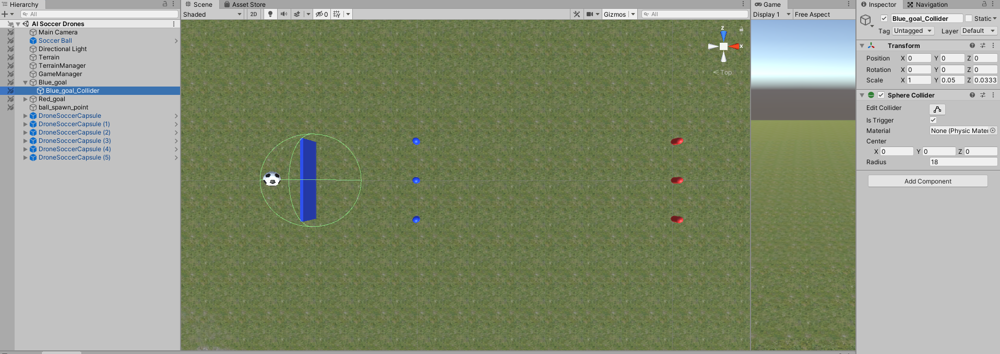
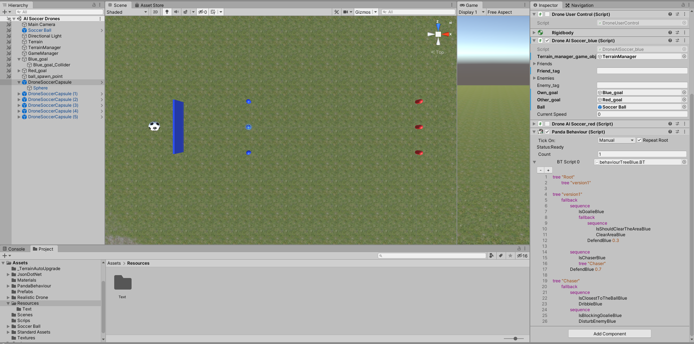

# DD2438VT201 Assignment 3, Group 6
Hi, here are the necessary scipts to make our drone soccer work. Read the README for help with setup, gl hf.
Necessary steps to run our agents:

1. Install PantaBT (link: https://youtu.be/UHgxZA7ejDg?t=145)
1. Pick between the two sides (red or blue). Let's assume our agents are team blue.
1. Place three blue agents on the field (drag and drop prefabs on hierarchy). We do not spawn our agents via the gamemanager.
1. Add Panda Behaviour component and attach it with the BehaviourTreeBTBlue.BT.
1. Add Drone AI Soccer_blue script component.
1. Attach a "Blue_goal_Collider" child object beneath the "Blue_goal" object and set its radius to 18. Make sure it is centered
around the "Blue_goal" transform position (simply reset its transform via the inspector). Tick "isTrigger" (so that agents do not
physicall colide with it).

# Example images on a correct setup
Goal collider setup

Drone agent

